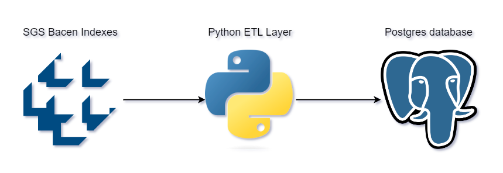

# Brazilian national rates Power BI dashboard

### This is a Power BI dashboard created with the aim of using Bacen's financial indicators table created in [BacenSgsIndexes](https://github.com/TiagoBHeck/BacenSgsIndexes) project.

## Objective

#### This dashboard aims to highlight some types of visualizations as in the cards on the first tab and highlight the financial indicators of Brazilian rates that are essential in company decision-making.

## About data transformation

#### The image below shows the data transformation flow before being used as a data source in Power BI. 
&nbsp;

## Dashboard tabs

### Acumulado 12 meses (12 months accumulated)

#### The first tab contains one of the most important calculations for analyzing these rates, which is the 12-month accumulation and its variations between months.
&nbsp;

### Variação mensal (Monthly variation)

#### The second tab shows how much each rate rises or falls over the months. The table below highlights the trend of recent months, bringing more clarity to the numbers.

## Next steps

### This is the second dashboard created and published in this data repository. The intention is to advance the development of advanced visualization capabilities in Power BI as well as data modeling and the use of other data acquisition tools.

## Author
- Tiago Bratz Heck
##### Access my [LinkedIn](https://www.linkedin.com/in/tiago-bratz-heck-0b9b5696/) profile.

